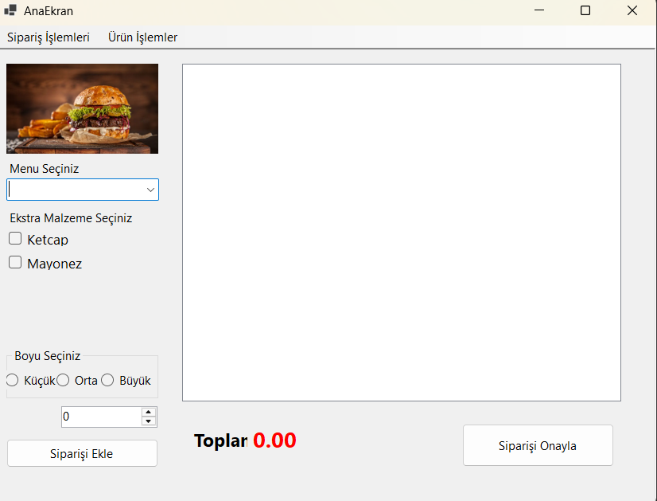
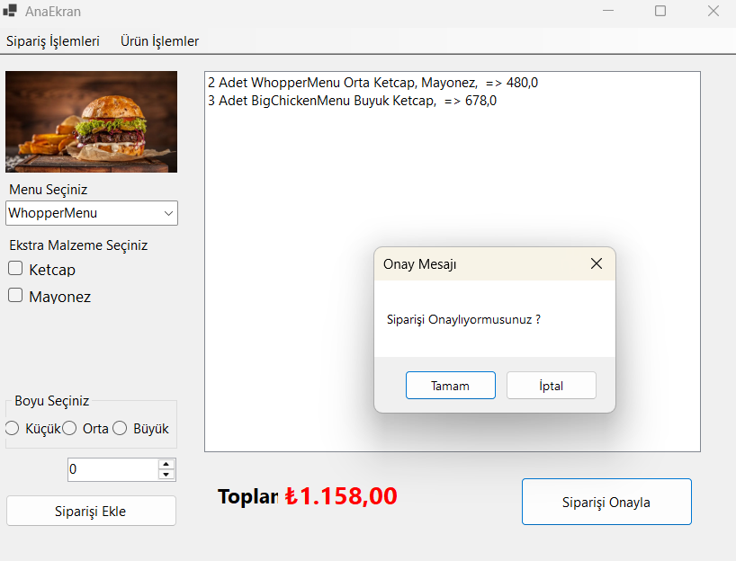
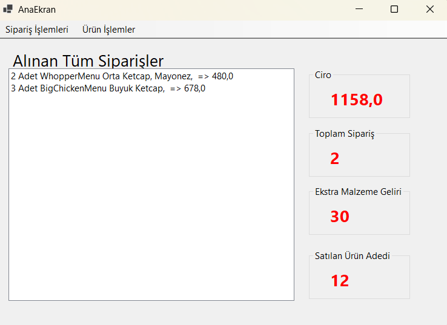
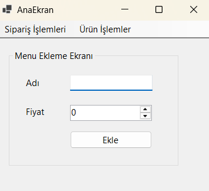
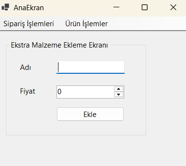

# HAMBURGER PROJESİ
## 📝 PROJENİN AMACI
### Bu proje, C# ile Windows Forms kullanılarak geliştirilen basit bir sipariş yönetim uygulamasıdır. Uygulama, kullanıcıların menüden ürün seçmelerine, ek malzemeler eklemelerine, boyut belirlemelerine ve siparişlerini onaylamalarına olanak tanır.

<h2>📌 Proje Özellikleri</h2>
<ul>
  <li>Menü Seçimi: Kullanıcılar farklı menü öğelerini seçebilir.</li>
  <li>Ekstra Malzeme Seçimi: Menüye ek olarak ekstra malzemeler seçilebilir.</li>
  <li>Boyut Seçimi: Küçük, Orta ve Büyük olmak üzere üç farklı boyut seçeneği mevcuttur.</li>
  <li>Sipariş Ekleme: Seçilen ürün ve seçeneklerle sipariş eklenebilir.</li>
  <li>Toplam Tutar Hesaplama: Kullanıcının sepetindeki siparişlerin toplam tutarı anlık olarak hesaplanır.</li>
  <li>Sipariş Onaylama: Kullanıcı siparişini onaylayabilir.</li>
  <li>Tüm Siparişleri Görüntüleme: Alınan tüm siparişleri listeleyerek toplam sipariş sayısı, toplam ekstra malzeme sayısı ve satılan ürün adetlerini görüntüler.</li>
  <li>Menü ve Ekstra Malzeme Yönetimi: Kullanıcı yeni menü öğeleri veya ekstra malzemeler ekleyebilir.</li>
</ul>

<h2>🛠️ Kullanılan Teknolojiler</h2>
<ul>
  <li>C# ile geliştirilmiştir.</li>
  <li>Windows Forms (WinForms) UI tasarımı için kullanılmıştır.</li>
  <li>OOP (Nesne Yönelimli Programlama) prensiplerine uygun olarak yazılmıştır.</li>
</ul>

<h2>🔥 Kullanım</h2> 
<ul>
  <li>Uygulama başlatıldığında, ana ekran üzerinden mevcut menüler ve ekstra malzemeler görüntülenir.</li>
  <li>Kullanıcı istediği menüyü seçer ve isteğe bağlı olarak ekstra malzemeleri ekler.</li>
  <li>Boyut seçimi yapıldıktan sonra sipariş sepete eklenir.</li>
  <li>"Siparişi Onayla" butonu ile sipariş tamamlanır.</li>
  <li>"Alınan Tüm Siparişler" ekranında alınan siparişlerin detayları görüntülenebilir.</li>
  <li>Menü veya ekstra malzemeleri yönetmek için ilgili ekranlar kullanılabilir.</li>
  
</ul>

### EKRAN GÖRÜNTÜLERİ

                      

